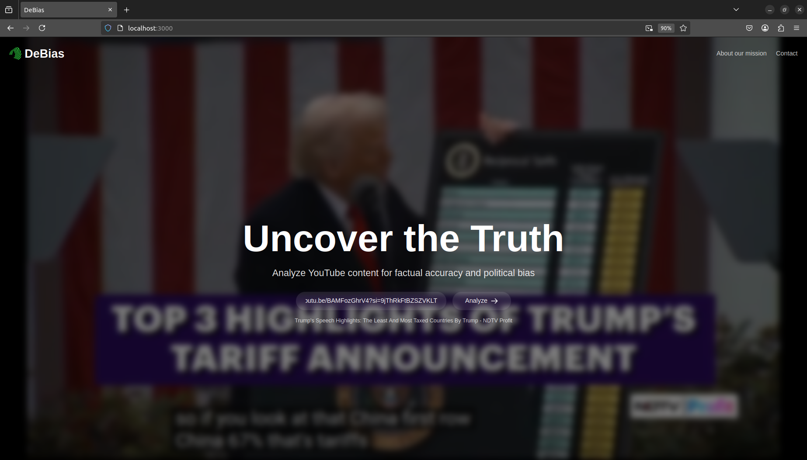
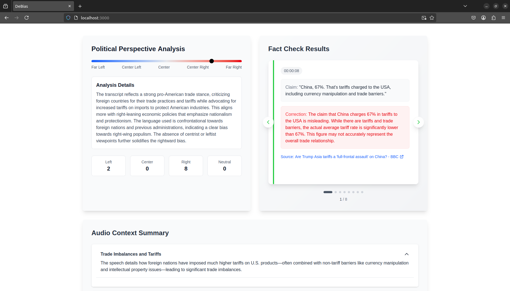

# DebiasIT
## Problem
In today’s world, we often need to stay cautious while watching YouTube videos.  
Frequently, these videos present opinions and information as absolute truth, even though they may be inaccurate or heavily influenced by left- or right-leaning political perspectives.
## Solution
DebiasIT analyzes YouTube videos by extracting audio, transcribing it, and using LLMs to estimate political bias with reasoning and fact-check key claims using web sources.  
It outputs a summary, bias analysis, and verified fact-checks.

## Features
- **Political bias analysis**: The transcript is extracted from the audio file by utilizing a spech-to-text model (Groq). This transcript is sent to our agent for bias analysis.
- **Fact checking with relavant sources provided**: The audio transcript is split into semantic pieces which are individually fact checked with relevant sources.
- **Audio summary**: A LLM summarizies the transcript.
# Architecture

# Future improvements
In the future, we plan to extend our analysis beyond audio by incorporating video content.  
By leveraging language-vision models, we can provide richer context and deeper insights to enhance our agent’s understanding.
